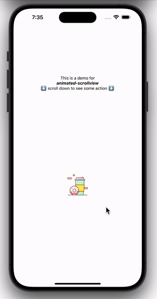

# animated-scrollview 🛝

[](https://www.npmjs.com/package/animated-scrollview)

A react native scrollview that lets you easily animate its children based on the scrolling position, to achieve classical one-pager animations etc.

## Demo

<a href="https://youtube.com/shorts/n11xdR605l0?feature=share"></a>
<a href="https://youtube.com/shorts/KOBtjLTFI68?feature=share"></a>

## Playground / Expo Snack

https://snack.expo.dev/@maks-io/animated-scrollview-demo

## Example Repository

https://github.com/maks-io/animated-scrollview-example-usage

## Installation

If you use expo, use:

```bash
expo install animated-scrollview
```

Otherwise, for npm use:

```bash
npm i animated-scrollview --save
```

And for yarn use:

```bash
yarn add animated-scrollview
```

## Usage

Use `import { AnimatedScrollview } from "animated-scrollview"` to access the main component.

Provide a unique key to every child in your `AnimatedScrollview`, plus provide a `config` prop to the `AnimatedScrollview` itself, where you are referencing the individual children - like so for instance:

```tsx
<AnimatedScrollview
  config={{
    firstChild: {
      fixate: false,
      relativeOffsetFromBottom: 0,
      springConfig: { mass: 2 },
      animation: {
        opacity: { start: 0, end: 1 },
        translateX: { start: 100, end: 0, unit: "%" },
        rotate: { start: 180, end: 0 },
        order: ["translateX", "rotate"],
      },
    },
  }}
>
  <View key="firstChild">
    <Text>My first Child</Text>
  </View>
  <View key="secondChild">
    <Text>My second Child</Text>
  </View>
  <View key="thirdChild">
    <Text>My third Child</Text>
  </View>
</AnimatedScrollview>
```

In the example above, only the first child would be animated, since there is no config for the second or third child provided.
The first child would have an opacity animation starting from 0 (invisible) to 1 (fully visible) plus some transform animations. Note, how the `order` prop is also provided, to define the order of transformations. This is mandatory. Any transform prop not occurring in the `order` array will have no effect. More details below.

## Configuration Details

Every child that you want to animate needs to have an entry in the `config` prop of the `AnimatedScrollview` component.

The following is a list of things you can configure on a per-child basis:

| prop                       | type                                                                         | required | default value                               | description                                                                                                                                                                                                                                                                                                                                                                                        |     |
| -------------------------- | ---------------------------------------------------------------------------- | -------- | ------------------------------------------- | -------------------------------------------------------------------------------------------------------------------------------------------------------------------------------------------------------------------------------------------------------------------------------------------------------------------------------------------------------------------------------------------------- | --- |
| `fixate`                   | boolean                                                                      | no       | false                                       | Setting this to `true` would not allow the child the animate "back out" anymore - like in this demo for instance (LINK FOLLOWING SOON)                                                                                                                                                                                                                                                             |     |
| `relativeOffsetFromBottom` | number                                                                       | no       | 0                                           | This is a percentage value (0 to 100) for offsetting where the animation of this child should start to trigger. By default this is set to `0`, meaning, as soon as the child appears on the bottom of the Scrollview's visible area, it will start animating in. Setting this to `50` would mean that the animation would start when the child reaches the vertical center of the Scrollview, etc. |     |
| `springConfig`             | See description                                                              | no       | `{ mass: 1, damping: 100, stiffness: 500 }` | This is the configuration for the spring animation for this child. Available settings can be found [in the react-native-reanimated documentation](https://docs.swmansion.com/react-native-reanimated/docs/animations/withSpring), which is the underlying animation library that the `animated-scrollview` library uses.                                                                           |     |
| `animation`                | (This prop has multiple sub props, check the following props for more info.) | yes      | `{}`                                        | (Check the description of the following props, which are sub props of the `animation` prop.)                                                                                                                                                                                                                                                                                                       |     |
| `animation.opacity`        | `{ start?: number, end?: number }`                                           | no       | `{ start: 1, end: 1 }`                      | Decides the start and end values for the child's opacity.                                                                                                                                                                                                                                                                                                                                          |     |
| `animation.rotate`         | `{ start?: number, end?: number }`                                           | no       | `{ start: 0, end: 0 }`                      | Decides the start and end values for the child's rotation. The unit is in degrees, entering `180` for instance would correspond to 180 degrees of rotation.                                                                                                                                                                                                                                        |     |
| `animation.scale`          | `{ start?: number, end?: number }`                                           | no       | `{ start: 1, end: 1 }`                      | Decides the start and end values for the child's rotation. A value of `1` means no scaling, as known from classical CSS transform scaling.                                                                                                                                                                                                                                                         |     |
| `animation.translateX`     | `{ start?: number, end?: number, unit: '%' \| 'px' }`                        | no       | `{ start: 100, end: 0, unit: '%' }`         | Decides the start and end values for the child's translate on the x-axis. The `unit` prop can be set to `"%"` or `"px"`. The former would mean, that the provided numeric values correspond to the child's width relatively - meaning, `100` would be 100% of the child's width. The latter turns the numeric values into simple pixel values.                                                     |     |
| `animation.translateY`     | `{ start?: number, end?: number, unit: '%' \| 'px' }`                        | no       | `{ start: 100, end: 0, unit: '%' }`         | Decides the start and end values for the child's translate on the y-axis. The `unit` prop can be set to `"%"` or `"px"`. The former would mean, that the provided numeric values correspond to the child's height relatively - meaning, `100` would be 100% of the child's height. The latter turns the numeric values into simple pixel values.                                                   |     |
| `order`                    | Transformation[]                                                             | no       | `[]`                                        | Decides the order of transformations. If you want the rotation to occur before a scaling you could provide `["rotate", "scale"]` for example. Please note, that every transformation (`rotate`, `scale`, `translateX`, `translateY`) that you wish to become visible, must occur in this `order` array - otherwise the corresponding animation is skipped.                                         |     |

## Stacking children / animations (using 'grandchildren')

Often you want to have different animations for different children, sitting on the same "level" along the y-axis. Like in this example (LINK FOLLOWING SOON), where there are 2 different animations happening "in the same row" (the picture is rotated in, etc., while the text is appearing via opacity).

To achieve this you would want to use grandchildren. The `animated-scrollview` library can animate both, children and the children of children, for accomplishing this.

Example:

```tsx
<AnimatedScrollview
  config={{
    firstGrandchild: {
      fixate: false,
      relativeOffsetFromBottom: 0,
      springConfig: { mass: 2 },
      animation: {
        translateX: { start: 100, end: 0, unit: "%" },
        rotate: { start: 180, end: 0 },
        order: ["translateX", "rotate"],
      },
    },
    secondGrandchild: {
      fixate: false,
      relativeOffsetFromBottom: 0,
      springConfig: { mass: 2 },
      animation: {
        opacity: { start: 0, end: 1 },
      },
    },
  }}
>
  <View key="firstChild">
    <Text>My first Child</Text>
  </View>
  <View key="secondChild">
    <Text>My second Child</Text>
  </View>
  <View key="thirdChild">
    <View key="firstGrandchild">
      <Text>My first grandchild</Text>
    </View>
    <View key="secondGrandchild">
      <Text>My second grandchild</Text>
    </View>
  </View>
</AnimatedScrollview>
```

Note that this works only for 2 levels, meaning children and grandchildren.

## Open Tasks

- add missing elements in README
- improve TypeScript usage, there are still 2 remaining `@ts-ignore` annotations

## Improvements / Ideas

- support more CSS transform properties, currently only `translateX`, `translateY`, `scale` and `rotate` are supported
- Allow generic / global `config`, so that not every child has to define its own config, as now is the case. Rather it should be possible to override configs for individual children, if desired.
- Same goes for the sub prop `springConfig`. It should be possible to set it globally but also override it for individual cases, to get more flexibility.
